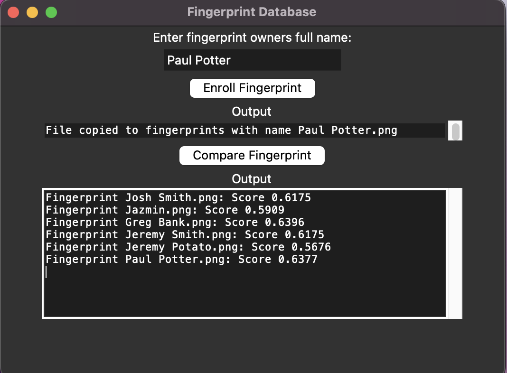

# A2 Progress

1.  TOC
{:toc}

## Question 1
Question one of assignment two is based on fingerprint recognition using computer vision techniques. I have been tasked with creating a Graphical User Interface (GUI), that allows a user to input fingerprint pngs with associated names. This isn't too hard, I have previous experience with creating GUIs in Python for ENGG2800. I ended up using Tinker, Python's basic GUI package as that's what I had used previously and it is very simple to implement.  

After a quick refresher course on Tinker, I implemented the first part of functionality, the ability to associate a name with a fingerprint found on your local machine and store it in a folder called "fingerprints". This required the os package in python to move copy files from different locations and change their names.  

Then came the computer vision aspect. Most of this was done by using code from Brian Lovells github repository. After merging the code with the GUI, I added additional functionality to compare a chosen fingerprint's likeness with all fingerprints that had been added to the fingerprints folder. Their likeness, as a score from 0 to 1, is then printed. This worked surprisingly well and required little adjustment to Brian Lovell's code. An image is shown below:  

## Question 2:

## Question 3:

## Question 4:

## Question 5:

